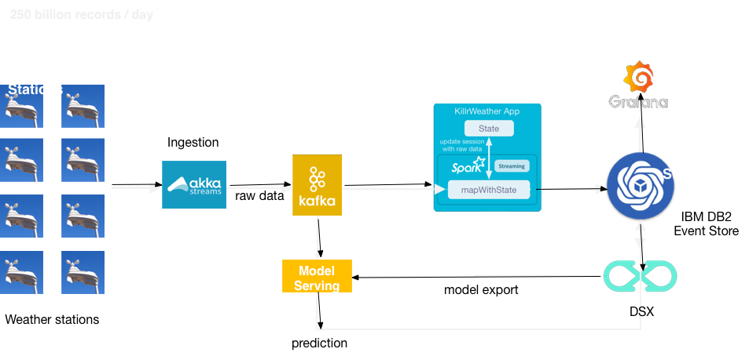

# KillrWeather Event Store

KillrWeather is a reference application (which is adopted from [Datastax's original application](https://github.com/killrweather/killrweather)) showing how to easily leverage and integrate
[DB2 Event Store](https://www.ibm.com/us-en/marketplace/db2-event-store) [IBM Data Science Experience local](https://datascience.ibm.com/local),
[Apache Spark](http://spark.apache.org), [Akka](https://akka.io/), [Apache Kafka](http://kafka.apache.org),
and [Grafana](https://grafana.com/) for fast, streaming computations. This application focuses on the use case of **[time series data](https://github.com/killrweather/killrweather/wiki/4.-Time-Series-Data-Model)**.

This application also can be viewed as a prototypical IoT (or sensors) data collection application, which stores data in the form of a time series.

> **Disclaimer:** This sample application is provided as-is, without warranty. It is intended to illustrate techniques for implementing various scenarios using Fast Data Platform, but it has not gone through a robust validation process, nor does it use all the techniques commonly employed for highly-resilient, production applications. Please use it with appropriate caution.

## Sample Use Case

_I need fast access to real time data to analyze it, execute machine learning and leverage these models for predictive analytics._


## Reference Implementation

Overall architecture of the implementation looks as follows




There are several modules in this application:
* [KillrWeather App](https://github.com/lightbend/fdp-killrweather-event-store/tree/develop/killrweather-app/src/main)
is based on Spark Streaming and is responsible for basic processing of incoming data and storing it to the IBM DB2 Event Store
* [Data Loader](https://github.com/lightbend/fdp-killrweather-event-store/tree/develop/killrweather-loader/src/main)
is a data loader (sensor simulator) for killrweather application, based on Akka Stream.
* [Model Listener](https://github.com/lightbend/fdp-killrweather-event-store/tree/develop/killrweather-modellistener/src/main)
is a model updates HTTP listener based on Akka Streams, responsible for accepting model updates from IBM DSX.
* [Model Server](https://github.com/lightbend/fdp-killrweather-event-store/tree/develop/killrweather-modelserver/src/main)
is an implementation of model serving, based on Akka Streams, responsible for weather prediction based on the model, generated leveraging IBM DSX.

## Configuring application

Application is configured using [typesafe config](https://github.com/lightbend/config).
Configuration file are located at the resources directory of every module. Examples of these config files are provided.


## Building and configuring applications

Applications are build using SBT and leverages [SBT Docker plugin](https://github.com/marcuslonnberg/sbt-docker).
It supports several commands:
* `sbt docker` builds a docker image locally
* `sbt dockerPush` pushes an image to the dockerHub
* `sbt dockerBuildAndPush` builds image and pushes it to the dockerHub
The SBt is building the following images:
````
lightbend/killrweatherappes                   1.2.0                           4fe93e7b6101        Less than a second ago   1.49GB
lightbend/modelserveres                       1.2.0                           0e400d0aa5bc        Less than a second ago   697MB
lightbend/modellisteneres                     1.2.0                           40ce669a50bd        Less than a second ago   601MB
lightbend/loader                              1.2.0                           d7c4e11a1627        Less than a second ago   577MB
````

## Deploying appliccation to FDP

The following templates for deploying application to DC/OS are provided.
* [KillrWeather App](https://github.com/lightbend/fdp-killrweather-event-store/blob/develop/killrweather-app/src/main/resources/killrweatherAppDocker.json.template)
* [Data Loader](https://github.com/lightbend/fdp-killrweather-event-store/blob/develop/killrweather-loader/src/main/resources/killrweatherloaderDocker.json.template)
* [Model Listener](https://github.com/lightbend/fdp-killrweather-event-store/blob/develop/killrweather-modellistener/src/main/resources/killrweatheModelListenerDocker.json.template)
* [Model Server](https://github.com/lightbend/fdp-killrweather-event-store/blob/develop/killrweather-modelserver/src/main/resources/killrweatheModelServerDocker.json.teplate)

## See What's Going On...

